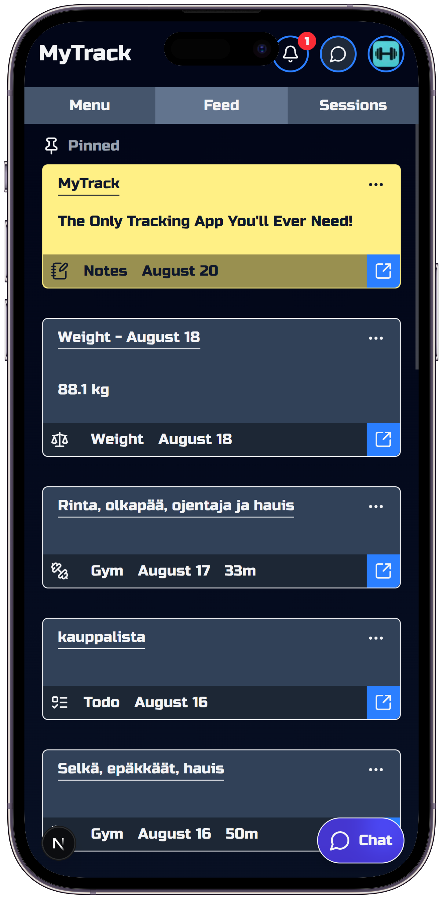

MyTrack

Your personal tracker — track **gym workouts, disc golf rounds, notes, to-do lists, weight, and time** in one place.

MyTrack includes a **web app (Next.js)** and a **mobile app (React Native / Expo)**.

## Live Demo

- 🌐 [Web App (Vercel)](https://training-app-bay.vercel.app/)
- 📱 Mobile App: Coming soon on Expo Go

> You can try the app with a **guest account**. From the login page, click “Guest Login” to explore the demo environment.

## Web App

**Tech Stack**

- **Framework:** Next.js
- **Hosting:** Vercel
- **Database & Auth:** Supabase (Postgres + Supabase Auth)
- **State Management:** Zustand
- **Styling:** Tailwind CSS
- **Data Fetching:** SWR (caching, optimistic updates, infinite scrolling)
- **Animations:** Framer Motion (swipe-based navigation)
- **Security** Vercel Bot Protection (BotID) on login & signup
- **Notifications:** Web Push Notifications (browser-based, Service Worker)

## 📱 Mobile App

**Tech Stack**

- **Framework:** Expo (React Native)
- **Database & Auth:** Supabase (Postgres + Supabase Auth)
- **State Management:** Zustand
- **Styling:** Nativewind
- **Data Fetching:** TanStack Query (caching, optimistic updates)
- **Navigation:** React Native Reanimated + Gesture Handler (swipe-based navigation)

## Installation

```bash
git clone https://github.com/MatiasTervonen/Training-App.git
cd training-app
```

## Run Web App

```bash
cd web
pnpm install
pnpm dev
```

## Run mobile app

```bash
cd mobile
pnpm install
pnpm start
```

## 📸 Screenshots


